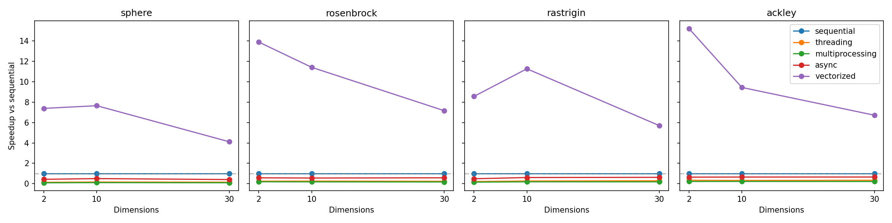
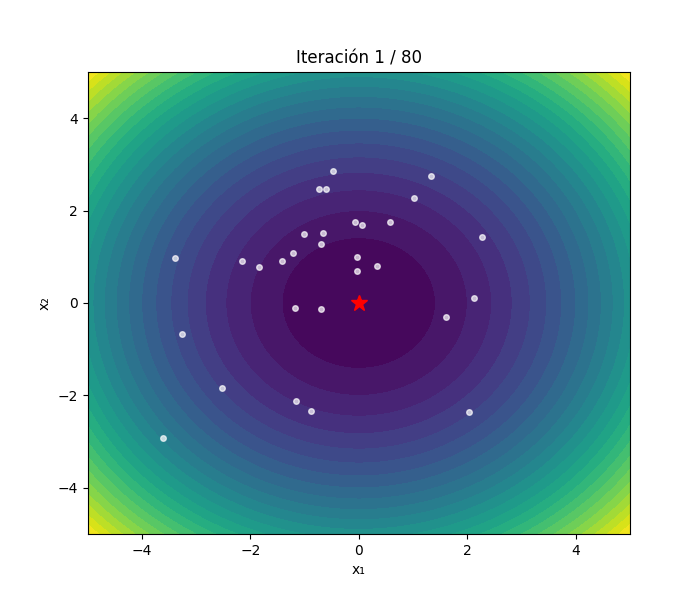
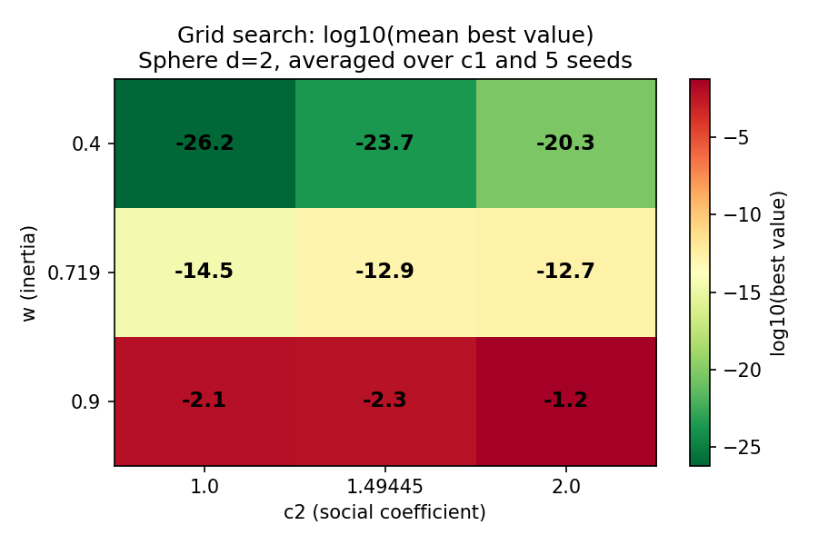

# Particle Swarm Optimization — Parallel & Concurrent Strategies


Five interchangeable evaluation strategies for Particle Swarm Optimization
(PSO) in Python — sequential, threading, multiprocessing, asyncio, and
vectorized NumPy — benchmarked on four standard functions and a real-world
SIR epidemic model calibration. Built on the Strategy pattern with dependency
injection, 78 tests, and reproducible multi-seed experiments.

*Full write-up with methodology, analysis, and all tables:
[`docs/report.md`](docs/report.md).*


*Speedup of each evaluation strategy relative to the sequential baseline (V0)
across four benchmark functions at d=30. V4 (NumPy vectorized) wins every
configuration; V1/V2 lose due to GIL and IPC overhead on cheap fitness
functions.*

---

## Key findings

- **V4 (NumPy vectorized)** is the fastest variant: **4–15x speedup** vs V0
  on benchmark objectives, by evaluating all particles at once via BLAS/SIMD.
- **V1 (threading)** is ~3–7x slower than V0 due to the GIL.
- **V2 (multiprocessing)** is ~5–17x slower than V0 on cheap objectives;
  batching at `chunksize=64` gives 13x improvement over `chunksize=1` but
  never crosses V0.
- **V3 (asyncio)** matches V0 with zero latency, but wins by **15–21x** once
  each evaluation has I/O-style latency.
- **SIR epidemic model**: on a real fitness costing ~1 ms per particle,
  V2 **finally wins** (2.19x speedup) and V4 wins (1.89x). Both correctly
  recover ground-truth parameters (beta=0.30, gamma=0.10, I0=10) from noisy data.
- The take-away: **"parallelism" is not one thing** — each strategy attacks
  a different bottleneck, and only the one matching the workload pays off.

---

## Results

### Timing comparison (d=30, 100 particles, 500 iterations, mean over 5 seeds)

| Objective  | V0 (s) | V1 (s) | V2 (s) | V3 (s) | V4 (s) | Speedup V4 |
|------------|--------|--------|--------|--------|--------|------------|
| Sphere     | 0.142  | 0.893  | 1.457  | 0.346  | 0.035  | **4.1x**   |
| Rosenbrock | 0.268  | 1.111  | 1.536  | 0.460  | 0.037  | **7.2x**   |
| Rastrigin  | 0.298  | 1.026  | 1.575  | 0.474  | 0.052  | **5.7x**   |
| Ackley     | 0.348  | 1.028  | 1.553  | 0.527  | 0.052  | **6.7x**   |

### Asyncio wins under latency (Sphere d=10, 20 particles)

| Latency / particle | V0 (s) | V3 (s) | Speedup |
|--------------------|--------|--------|---------|
| 1 ms               | 0.65   | 0.031  | **21x** |
| 10 ms              | 3.70   | 0.202  | **18x** |
| 50 ms              | 17.97  | 0.848  | **21x** |

### SIR epidemic model calibration (100 particles, 100 iterations, 3 seeds)

| Evaluator          | Time (s)        | Speedup  | beta   | gamma  | I0    |
|--------------------|-----------------|----------|--------|--------|-------|
| V0 sequential      | 13.41 +/- 0.56  | 1.00x    | 0.2965 | 0.0998 | 11.78 |
| V2 multiprocessing | **6.13 +/- 0.83** | **2.19x** | 0.2965 | 0.0998 | 11.78 |
| V4 vectorized      | **7.11 +/- 0.03** | **1.89x** | 0.2965 | 0.0998 | 11.78 |

*Ground truth: beta=0.30, gamma=0.10, I0=10. All variants recover the same
parameters within the 5% noise budget.*

### Visualizations

<table>
<tr>
<td></td>
<td></td>
</tr>
<tr>
<td><em>Swarm converging on Sphere d=2</em></td>
<td><em>Hyperparameter sensitivity: inertia weight vs social coefficient</em></td>
</tr>
</table>

---

## Installation

```bash
git clone https://github.com/DanielSainz1/ProgramacionParalela.git
cd ProgramacionParalela
python -m venv .venv
source .venv/bin/activate
pip install -e ".[dev]"
```

Dependencies: NumPy, Matplotlib, PyYAML (installed automatically).
To run the PySwarms baseline comparison, also install the optional extra: `pip install -e ".[baseline]"`.

---

## Commands

| Command | Description |
|---|---|
| `python scripts/run_pso.py` | Single PSO run (default: sphere, d=30, seed=42) |
| `python scripts/run_pso.py --objective rastrigin --dim 10 --seed 99` | Custom parameters |
| `python scripts/run_pso.py --evaluator vectorized` | Choose evaluator |
| `python scripts/run_pso.py --profile` | Profile with cProfile |
| `python scripts/run_comparison.py` | Multi-seed speedup comparison (V0–V4) |
| `python scripts/run_batching_experiment.py` | V2 chunksize sweep (1–128) |
| `python scripts/run_latency_experiment.py` | V0 vs V3 with simulated I/O latency |
| `python scripts/run_sir_comparison.py` | All 5 variants on SIR calibration |
| `python scripts/run_pyswarms_baseline.py` | Convergence vs PySwarms library |
| `python scripts/run_grid_search.py --objective sphere --dim 2` | Hyperparameter grid search |
| `python scripts/run_benchmarks.py` | Full benchmark: 4 functions x 3 dims x 5 evaluators |
| `python scripts/make_viz.py --run-dir results/<folder>/` | Generate plots and animations |
| `python scripts/analyze_results.py --results-dir results/` | Convergence analysis and summary |
| `pytest` | Run test suite (78 tests) |

---

## Architecture

```
src/pso/
├── core/               # PSO engine
│   ├── pso.py          # run_pso() — main loop, returns PSOResult
│   ├── state.py        # SwarmState dataclass
│   ├── bounds.py       # BoundsPolicy ABC → ClampBounds, ReflectBounds
│   └── topology.py     # Topology ABC → GlobalBestTopology, RingTopology
│
├── eval/               # Fitness evaluators (Strategy pattern)
│   ├── base.py         # BaseEvaluator ABC (open/close lifecycle)
│   ├── sequential.py            # V0: baseline loop
│   ├── threading_eval.py        # V1: ThreadPoolExecutor
│   ├── multiprocessing_eval.py  # V2: ProcessPoolExecutor + batching
│   ├── async_eval.py            # V3: asyncio.gather
│   └── vectorized_eval.py       # V4: NumPy BLAS/SIMD
│
├── objectives/         # Benchmark functions (scalar + vectorized)
│   ├── sphere.py, rosenbrock.py, rastrigin.py, ackley.py
│   └── sir.py          # SIR epidemic model calibration
│
├── experiments/        # Orchestration
│   ├── config.py       # PSOConfig dataclass + YAML loading
│   ├── runner.py       # run_pso_from_config() + EVALUATORS registry
│   └── grid_search.py  # Hyperparameter sweep → CSV
│
├── io/                 # Persistence
│   ├── metadata.py     # Git hash + hardware info capture
│   └── persistence.py  # save_run() → config.json + metrics.csv
│
└── viz/                # Visualization
    ├── convergence.py      # Convergence plots
    ├── swarm_animation.py  # 2D particle animation (GIF)
    └── swarm_3d.py         # 3D particle animation (GIF)

tests/                  # 78 tests across 16 files
scripts/                # CLI entry points and experiments
configs/                # YAML parameter files
docs/                   # Design document + full report
```

### Design

`run_pso()` is agnostic of the evaluator, boundary handling, and topology —
all three are injected via ABCs (Strategy pattern):

```
BaseEvaluator (ABC)                    BoundsPolicy (ABC)       Topology (ABC)
├── SequentialEvaluator      (V0)      ├── ClampBounds          ├── GlobalBestTopology
├── ThreadingEvaluator       (V1)      └── ReflectBounds        └── RingTopology
├── MultiprocessingEvaluator (V2)
├── AsyncEvaluator           (V3)
└── VectorizedEvaluator      (V4)
```

### Evaluation strategies

| Variant | Strategy | Mechanism | Best for |
|---------|----------|-----------|----------|
| V0 | Sequential | Simple loop | Cheap objectives (baseline) |
| V1 | Threading | `ThreadPoolExecutor` | I/O-bound work (GIL limits CPU gains) |
| V2 | Multiprocessing | `ProcessPoolExecutor` + batching | Expensive CPU-bound fitness (>1 ms) |
| V3 | Asyncio | `asyncio.gather` | I/O-latency-dominated evaluations |
| V4 | Vectorized | NumPy matrix operation | Any objective expressible as NumPy ops |

---

## Benchmark functions

| Function | Global minimum | Bounds | Difficulty |
|---|---|---|---|
| Sphere | f(0,...,0) = 0 | [-100, 100] | Low — unimodal |
| Rosenbrock | f(1,...,1) = 0 | [-5, 10] | Medium — curved valley |
| Rastrigin | f(0,...,0) = 0 | [-5.12, 5.12] | High — many local minima |
| Ackley | f(0,...,0) = 0 | [-32.768, 32.768] | High — deceptive landscape |

---

## Configuration (default.yaml)

| Parameter | Value | Description |
|---|---|---|
| `w` | 0.719 | Inertia weight (Clerc-Kennedy constriction) |
| `c1` | 1.49445 | Cognitive coefficient |
| `c2` | 1.49445 | Social coefficient |
| `n_particles` | 100 | Swarm size |
| `max_iter` | 500 | Maximum iterations |
| `seed` | 42 | Random seed |

---

## Tests

```bash
pytest
```

**78 tests across 16 files** covering: objective correctness, convergence,
monotonic gbest, bounds enforcement, both bounds policies, both topologies,
reproducibility, pool lifecycle, pickle validation, velocity clamping,
callbacks, evaluator equivalence, persistence, and grid search.

---

## Reproducibility

- All runs accept a `seed` parameter (NumPy `default_rng`)
- Config saved alongside results (parameters + git hash + hardware info)
- Timing uses `time.perf_counter` for precision
- Full reproduction instructions in [`docs/report.md`](docs/report.md)

---

## Author

Daniel Sainz — [GitHub](https://github.com/DanielSainz1)
